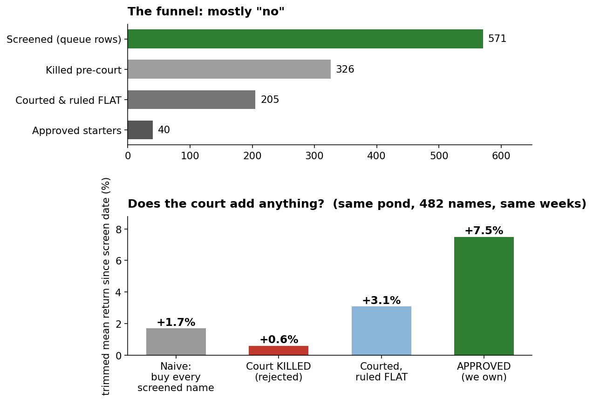
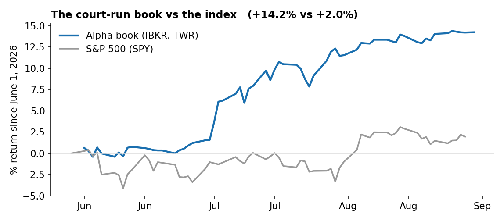
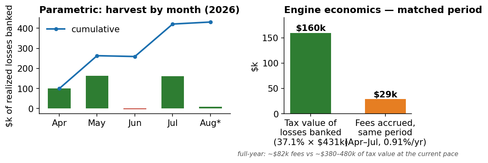
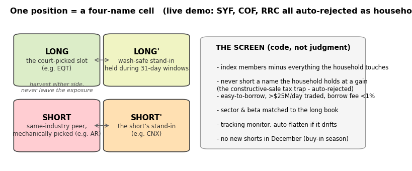
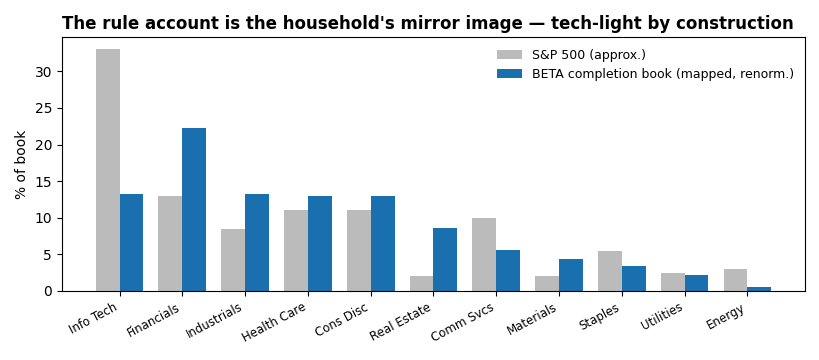
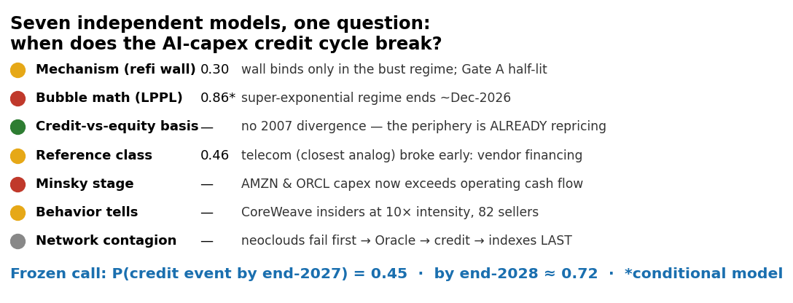
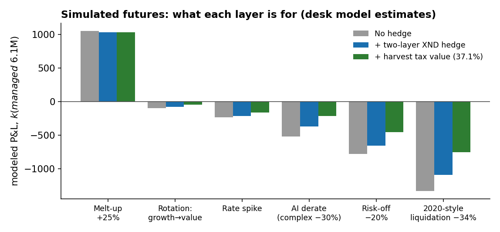
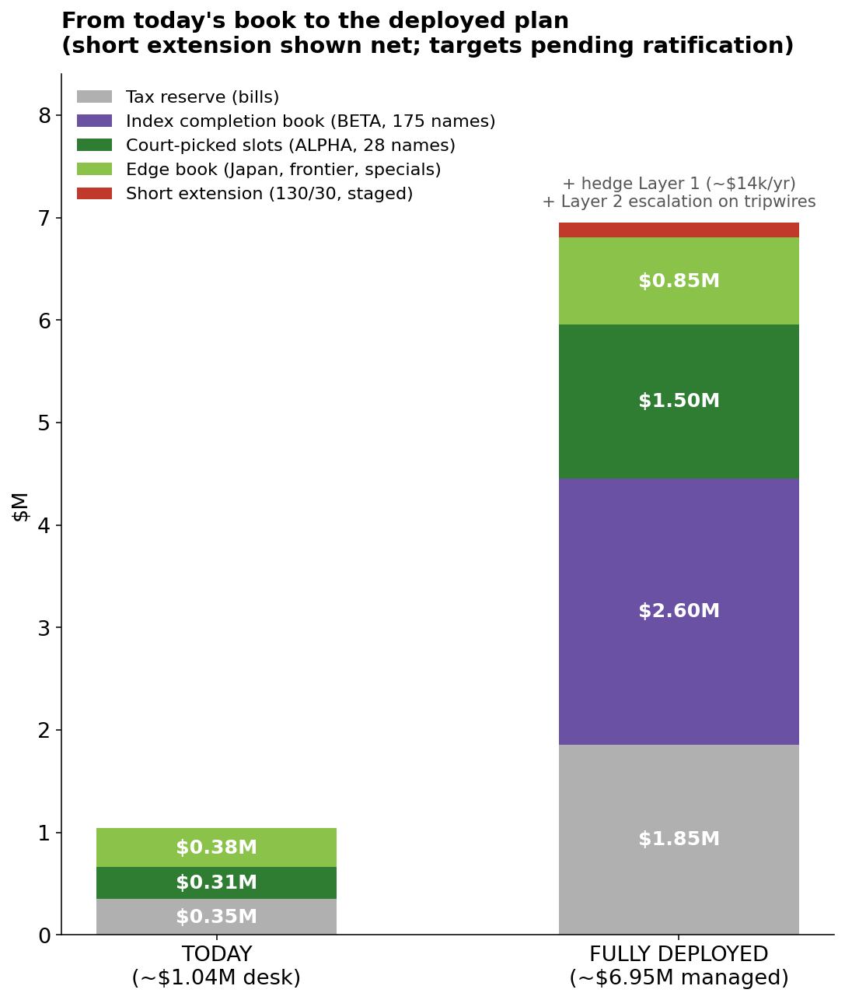

# THE FAMILY OFFICE WE BUILT
### A personal hedge fund, a tax machine, and a risk program — run by an AI research desk that must prove every claim
**August 29, 2026 · the culmination document · plain language, real numbers, honest caveats**

---

## 1. What this is

Over the past six months we built a complete private investment operation: a stock-picking fund
where every position must survive an adversarial court; a tax-loss-harvesting machine designed
around a $5M gain landing in September; and a research program that models the one risk big
enough to hurt the whole household — an AI-sector break. Everything below is measured, graded,
and committed to a permanent record. Where a number is a model estimate, it says so.

## 2. The machine that says no

Every idea — screened dislocations, Reddit pitches, our own hunches — enters the same conveyor:
verification, then a prosecution (red), a defense (blue), and a final judgment that re-checks
every load-bearing number against original filings. The machine's defining output is rejection.

**571 names have entered; 326 were killed; most survivors were ruled "fair — don't buy."** The
right chart is the test that matters: take every name the screens surfaced and track it from that
day. Buying *everything* returned +1.7%. The names the court **killed**: +0.6%. The names it
**approved and we bought**: **+7.5%** — roughly seven points of selection skill over its own
rejects, in the same pond, over the same weeks. (482 names measured; short window; one honest
caveat — a filter that rejects garbage occasionally rejects a lottery ticket.)

The desk also keeps score on itself: **378 timestamped predictions** in a frozen ledger
(92 already graded, average Brier score 0.192 — meaningfully better than coin-flipping), and
**864 reusable detection patterns** harvested from courts into a knowledge graph. The graph, the
scorecard, and the rulebook are the durable asset; the portfolio is just this year's output.

## 3. Performance so far

Since the book became fully funded on June 1, the court-run account has returned **+13.4% versus
+1.5% for the S&P 500** (time-weighted, through Aug 29; +16.8% from March inception). Just as
telling is *how*: realized trading profits are a modest +$11k — nine disciplined trims of
winners, one options assignment, and exactly one realized loss, which was a deliberate tax
harvest. The rest is unrealized, sitting in positions the courts still endorse. Winners were let
run (SUJA +59%, ARX +58%, GCT, CAI); nothing was churned.

**And the return is not borrowed from the market.** Measured daily since funding, the book's
**beta to the S&P 500 is 0.18, and to the Nasdaq effectively zero (−0.02)** — with *lower*
volatility than the index itself (11.8% annualized vs the S&P's 13.6%). In plain terms: the
+13.4% was earned by security selection across small caps, Japan, and special situations, not by
riding the index — the two curves in the chart above are nearly independent lines. (Honest
footnote: about a quarter of the book prices in Tokyo and Europe hours, which mechanically
dampens measured beta somewhat; even doubling the estimate leaves the book market-light. 63
daily observations.)

## 4. The tax engine already running

The household's externally-managed harvesting account (Parametric, $9.2M levered long/short) has
banked **$431k of realized losses this year** — worth about **$160k of tax savings** at our
37.1% marginal rate against the September gain. Over the *same* April–July window it accrued
about **$29k of fees** (0.91% a year, all-in): the engine pays for itself **five times over,
period-matched** — and at the current pace, roughly $380–480k of annual tax value against $82k
of annual fees — *before counting its market return*. June's pause in
the chart is why we now audit it monthly. Our own account added a first harvested loss (−$1.9k,
wash-clean) as a dry run of the same discipline.

## 5. The plan for the September $5M, in one paragraph

Reserve **$1.855M for tax** in Treasury bills on day one. Deploy **~$1.9M into 32 pre-approved
single names within three weeks** — single names disperse, and dispersion is what creates
harvestable losers before December 31, when losses stop offsetting this year's gain. Put
**~$1.3M into two broad index funds** as permanent market exposure. Every name carries a
pre-assigned wash-safe replacement partner; November 28 is the last day to "double up" into
December harvests; a code layer now enforces the wash and constructive-sale rules that used to
live in someone's memory. The new money lives in a separate account that is *forbidden by
construction* from holding anything the courts picked — judgment and rule never mix.

**The proposed upgrade: make the rule-driven account long/short — against itself, never against the stock-picks.** A long-only book harvests only when things fall; if the market melts up into December, the year's harvest can quietly fail in the *good* scenario. The fix is a rule-based short book that gives the portfolio red lots in either direction — market up, harvest the shorts; market down, harvest the longs. Net market exposure is unchanged: this is insurance on the harvest deadline, not a market bet.

One boundary is absolute, and an earlier draft of this section got it wrong: **the two accounts never reference each other.** The judgment account (court-picked names) stays long-only with its own wash-partner map; the rule account runs the extension **against its own index book** — shorts sector- and beta-matched to what *it* holds, both sides selected by code. Judgment never touches the short book; the short book never touches the judgment names. Staged: 115/15 in October, full 130/30 in November only if a month of operations runs clean.

Within the rule account, every exposure still forms the **four-name cell** — long, wash stand-in, short, short's stand-in — so either side harvests without ever leaving the exposure. The short *universe* is screened by code: index members, minus the 1,472 names the household touches, minus anything held at a gain anywhere (shorting those triggers a tax trap that *creates* gains — the screen caught Synchrony, Capital One, and Range Resources on its first live run), easy-to-borrow, >$25M/day traded.

**The screened short universe, by industry (v0, 8/29):** software SNOW · IBM · BOX · OKTA · ADSK; banks/finance EWBC · WTFC · ALLY · ENVA; insurance RNR · HCI; healthcare NTRA; services INFY; energy AR · CNX · IMO; consumer ANF · GAP · ULTA. Sized to the rule account's own sector weights — not paired to any picked name. In several industries (managed care, drug distribution, integrated oil) the household already owns *every* large peer at a gain, so those sectors short via small ETF clips — independently converging on exactly the structure our external manager runs, derived from the tax rules rather than copied.

**What the rule account actually holds (generated 8/30, not assumed):** $2.78M across 175
names — Medtronic, AT&T, IBM, Lowe's, Progressive, Morgan Stanley, Stryker, BlackRock at the top —
the large-cap quality the household *doesn't* already own. The tax logic produced an accidental
masterpiece of diversification:

Because the external manager already holds all of mega-tech and every oil major, the completion
book lands at roughly **13% technology versus the index's ~33%, and under 1% energy** — the
household's AI concentration gets its counterweight *by construction*, with nobody picking it.
The short book mirrors this same mix (financials-heavy, tech-light): it is harvest machinery,
deliberately **not** an AI short — that tail belongs to the hedge. Sized to the live book:
**~$420k of shorts at the October 115/15 stage, ~$835k at full 130/30**, trued down quarterly
as capital rotates to the stock-picking account. One last boundary, caught by generating the
real basket rather than reasoning about it: two names from the draft short list (IBM,
Progressive) turned out to be top-12 *longs* in this very book — so the screen now excludes
the rule account's own holdings, its third and final wall.

*The honest trade-off, stated for the decision:* the extension sizes to the rule account's LIVE book, which the band-gated deployment (below) makes larger than first drafted — ~$2.8M at landing, shrinking as stock-pick entry bands fill. 130/30 is proposed as the ceiling: levering a deliberately-shrinking base harder (140/40) stays a one-line amendment for November, taken only with a demonstrated December harvest gap and a clean October of operations. Awaiting sign-off alongside the hedge.

## 6. What happens when things break

We spent as much effort on drawdowns as on picks. Seven independent models were built to answer
one question — *when does the AI-capex credit cycle break?* — and they converge on **45% odds of
a credit event by end-2027**, with a specific sequence: the levered AI-cloud periphery cracks
first, credit second, the big indexes last. That ordering is why our tripwires (CoreWeave's
credit, the OpenAI IPO's terms, the first capex cut the market *rewards*) are designed to fire
before the part that hurts us.

The models were built to disagree, and their disagreement is the information: the bubble-math
model dates the mania's end near December 2026 while the mechanism model says the debt wall
doesn't bind until 2028 — and the referee between them is the reference class, where the closest
historical analog (telecom, 2000) broke *early*, while capex was still rising, because the
suppliers had become the lenders. NVIDIA holding equity stakes in its own customers is Lucent's
vendor financing wearing new clothes. The canary is already coughing: CoreWeave shows distress
in three unrelated datasets — its credit pricing, its insider selling, and its position as first
to fail in every simulated cascade.

**The insurance we propose to buy — and what we refused.** The naive answer (index puts on the
whole exposure, ~$45–90k a year) and the "cheap" answer (a collar that funds puts by selling
calls) were both rejected: the first pays full price for warning our tripwires already provide,
and the second sells the melt-up — unacceptable for a household still expecting inflows. What we
propose instead is **two layers matched to how information arrives**:

- **Layer 1, bought now:** Dec-2027 put spreads on the Nasdaq-100 (via XND), covering ~10–17% of
  the household's $4.5M AI overlap. Cost: **~$10–18k per year** — sized only to the branch where
  the break comes with *no* warning, because that's the only branch we're truly naked in.
- **Layer 2, bought on evidence:** a pre-registered escalation to ~**50% of the overlap
  (~$2.2M of protection)** within five trading days of any tripwire firing — CoreWeave credit
  event, the OpenAI IPO pricing below its last private mark, or the first capex cut the market
  rewards. We accept paying crisis prices at that moment; the decision is made now, calmly, so
  only the execution waits.
- **Stand-down:** if the quarterly re-freeze drops the odds below ~0.35 twice running, Layer 1
  simply doesn't renew. Total cost of being wrong about the whole thesis: a low-five-figure
  premium, versus a mid-six-figure loss absorbed if we're right and unhedged.

The simulation above stress-tests the full post-landing plan (~$6.1M managed) across six
futures — from melt-up to a 2020-style liquidation. Three layers do the work: the **hedge**
(small standing put-spreads, escalated on pre-registered tripwires — never a structure that caps
our upside, because this household expects more inflows); the **tax code** (every realized loss
in a drawdown refunds ~37 cents on the dollar against this year's gain); and **construction**
(the stock book spreads across 10.6 effective sectors, so rotations mostly cancel — a
growth-to-value rotation models at about −1.5% while a true market crash is the hedge's job, not
the stock-picker's). In the worst simulated future the plan loses roughly **−$750k after all
layers versus −$1.33M naked**; in the melt-up it keeps essentially everything, because we
refused to sell the upside to pay for the insurance.

## 7. Why this compounds

The moat is not the picks. It is the **process that cannot be bought**: a knowledge graph of 864
verified failure-patterns that makes every future court smarter; a calibration ledger that makes
our confidence auditable; and a capacity ceiling — thin, uncovered, primary-source-verified
paper — that is a *feature*, because the edge lives exactly where institutions can't deploy.
The same machinery is productizable (working name: **Antifragile Carry** — positive-carry
resilience, capacity-capped by design, the calibration ledger as an un-gameable track record),
with this book as its audited seed.

## 8. What we own today

The desk account: **$1.04M**, ~90 positions, every one tracing to a court record. Book beta 0.18
to the S&P, −0.02 to the Nasdaq, 11.8% volatility.

| Sleeve | ~Value | Holdings | Notable names |
|---|---|---|---|
| Dry powder | **$350k** (34%) | T-bill ETF + cash | the resting-buyer option — our cheapest black-swan long |
| US court book | **$500k** | ~50 names | WAL $52k (bank + credit-cycle sensor) · DFIN $35k · EG $20k · KNSL · GCT · CAI · OMF · PINS · PHYS (gold) · UCTT (filled at its band last week) |
| Japan sleeve | **$62k** | 13 names | Hosiden $19k (bought under its convertible ceiling) · Socionext · Tachi-S · Sanyu/Atomix (daily-lot accumulation) |
| Europe & frontier | **$115k** | ~15 names | Central Asia Metals $16k · Kalmar $17k · Burberry $13k · Halyk Bank GDR $11k · Verallia · Bavarian Nordic |
| Income & catalyst overlay | net ~**+$9k** | 8 option lines | cash-secured puts (QCOM, MCHP, EQT, FAF) behind ruled floors · WYNN call spreads (the Macau Sept 1 catalyst) |

## 9. What we propose to buy when the cash lands

| Bucket | Amount | When | Instrument | Condition / gate |
|---|---|---|---|---|
| Tax reserve | **$1.855M** | day 1 | Treasury bills | trued up at landing |
| Index completion book | **~$2.8M** → drifts to ~$1.7M | week 1 | 175 names (MDT, T, IBM, LOW, PGR...) | mechanical basket; shrinks as rotations fund slots |
| Deploy-on-landing slots | **~$400k** | weeks 1–3 | WRB · MCK ladder · WAL band · BKE · VRLA | only names at/below fair value today |
| Band-gated slot capacity | **~$1.1M** | as prices reach bands | insurance raises (EG, HRTG, KNSL) · EQT via cash-secured puts · CAI (band court pending) · BGSI (new slot) | pre-authorized, never chased; funded by index rotation — each rotation books a loss or defers a gain |
| Short extension | to **−$835k** | Oct 115/15 → Nov 130/30 | completion-set shorts (ANF/AR/HCI-class) + sector-ETF clips | clean-ops month gates each step; no new shorts in December |
| Hedge — Layer 1 | ~$0.7–1.2M notional (**~$14k/yr**) | phased with deployment | Dec-2027 XND put spreads (10%/30% OTM) | renews only while break-odds re-freeze ≥0.45 |
| Hedge — Layer 2 | ~**$2.2M** notional | within 5 days of a tripwire | plain XND puts at crisis prices | Gate A · CoreWeave credit event · first rewarded capex cut · re-freeze ≥0.55 |

**End state: ~$6.95M managed** — a third rule-driven index, a quarter court-picked conviction, a
quarter reserve, the rest edge — hedged against the one risk big enough to matter, harvesting in
every direction of the tape, and still 100% net long the future.

---
*Caveats, stated plainly: the track record is six months old; most performance is unrealized;
scenario figures are desk model estimates with stated assumptions, not guarantees; the cohort
study covers weeks, not cycles; Parametric's market return is not measured here — only its tax
engine. Sources: IBKR PortfolioAnalyst (TWR), the court queue and calibration ledger (committed
in git), Parametric statement bundles, desk model files. Full technical version:
HOUSEHOLD_FINANCIAL_PLAN_20260829.pdf.*
