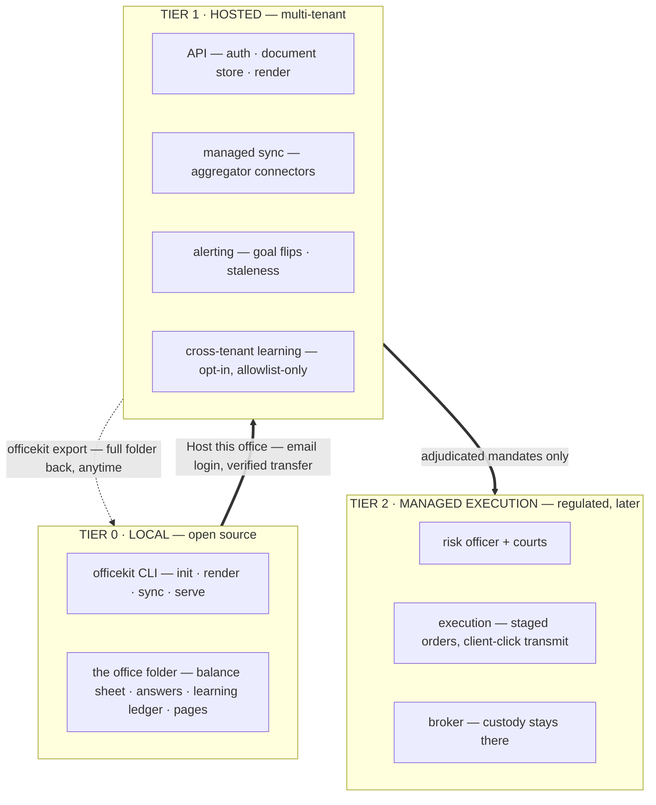

# Technical Architecture — The Family Office Platform

Companion to [PRD v1.2](PRD.md) · v1.1 · 2026-09-03 · status: proposed, Tier-0 partially SHIPPED

**Current implementation supplement (2026-09-13):** read
[OPERATING_CONTRACTS.md](OPERATING_CONTRACTS.md) for scoped custody reconciliation,
the native court/holdings/outcome loop, strategy-pack trust, modeled stress and the
installed-package boundary, and the daily brief / strategy workspace UX contracts. [AGENT_HANDOFF.md](AGENT_HANDOFF.md) records verification
and remaining migration work. The tier design below is historical design context;
its CLI, dependency and shipped-status descriptions are not a current inventory.
The distribution is `worker-placement` with `wp` / `worker-placement` commands,
six packages and default broker-library dependencies. The hosted transport uses the same office UI and manual editing engine; hosted AI execution remains future work.

**Hosted onboarding direction (2026-09-15):** the primary local-to-hosted entry is
**Host this office → email sign-in → automatic transfer → open hosted office**.
Read [HOSTED_ONBOARDING.md](HOSTED_ONBOARDING.md) for the customer flow, verified
transfer, active-office policy and connector reconnect behavior. The first shipped interface uses `curl …/install.sh | sh`, `./wp login`, and `./wp migrate`. Email accounts, encrypted private snapshots, viewing/export and shared seeded research are deployed. The local migration UI and shared hosted workspace now ship. Scoped upload grants, AI keys/jobs and connector reconnects remain planned. See [hosted service operations](../hosting/README.md).

**The goal ladder:** (0) any user pulls the open source and has their own office + scenario planner running locally in minutes → (1) that user graduates, when *they* choose, to a hosted multi-tenant app that syncs their data continuously → (2) eventually, the app can manage execution for them. Each tier is opt-in, and the tier below always keeps working — no lock-in is the trust posture that matches the glass-box brand.

**The load-bearing design decision:** everything crosses boundaries as versioned data contracts (BalanceSheet, answers JSON, SyncSnapshot, learning records). The local folder and the hosted tenant hold the *same documents*, so graduating a user is a transport problem, not a migration project. The engine is one library used by every tier.

## 1. The three tiers

The engine (schema, model, betas, effects, scenarios, mitigations, goals, sync contract, learning, renderers) is **one Python package with zero runtime dependencies** — already true today — and every tier imports the same version of it. Nothing is forked per tier; the tiers differ only in transport, storage, and permission.

**DESK DEPRECATION (principal ruling 2026-09-05):** the desk is to be DEPRECATED, not bound into serve — the app is the product and the principal onboards into it like any user (auto-adapter import from the live IB Gateway, goals via the UI). Desk machinery migrates through the registries (capabilities, adapters, courts) until the desk binding renders nothing the app doesn't.

## 2. Tier 0 — local, runnable in minutes

The bar: **clone → first scenario-planner page in under five minutes, offline.**

- **Distribution:** `pipx install officekit` (or `uvx officekit`). Core stays stdlib-only — no dependency resolution can fail on a user's machine. Optional extras pull dependencies: `officekit[server]`, `officekit[plaid]`.
- **CLI:**
  - `officekit init [dir]` — the wizard interview (or `--answers file.json`); writes the office folder.
  - `officekit render` — office + scenario-planner + strategies pages from the folder.
  - `officekit sync` — runs registered connectors, applies freshness stamps, re-renders.
  - `officekit serve` — **SHIPPED (v0, 2026-09-03 state)** as `python3 -m officekit.serve`: stdlib `http.server` on localhost serving in-browser onboarding on an empty folder (typed holdings AND CSV upload — both through one classifier — plus sleeves, income-as-asset, goals, collapsed advanced section), then an app shell with OFFICE / SCENARIO PLANNER / STRATEGIES tabs. Two write endpoints beyond onboarding, both mandate actions: `/strategy/adopt` (explicit adoption of a planner mitigation) and `/strategy/new` (ad-hoc principal-directed creation, library-attach or custom). No accounts, no network calls.
- **State = a folder.** `./office/` holds `balance_sheet.json`, `answers.json` (including `strategy_decisions` — the mandate paper trail: every strategy decision carries origins `{source: principal|scenario|agent, ref, date}`), `personal_context.json` (plane 2 — the tenant's constraints, written as an empty skeleton at onboarding and mandatory for every shipped agent), `learning.jsonl`, `pages/`. Plain files: inspectable, git-versionable, backed up by whatever the user already uses. "Your office is a folder" is the local-first pitch and the export format in one.
- **Plugins via entry points** (`officekit.effects` / `.importers` / `.scenarios` / `.betas` / `.connectors`): a community Schwab importer or a new effect is a pip package; the registries discover it. The connector long tail is the compounding asset — contributed integrations work identically in Tier 0 and Tier 1.
- **Auto-adapters (SHIPPED 2026-09-05, principal-directed):** `officekit_adapters` — on the onboarding page (and `officekit discover`) the app scans THIS machine read-only for live brokerage connections and offers one-click position import that pre-fills the form. Contract: a registered probe (`detect`, sub-second, never authenticates) + optional fetcher (`fetch_positions`, read-only). Shipped fetchers: IBKR TWS/IB Gateway socket API (ib_insync via the `ibkr` extra; live-proven 111 positions incl. options), IBKR Client Portal gateway (REST, AirPlay-on-5000 false positive guarded), Alpaca (env keys), broker CSV exports sniffed in Downloads/Desktop. Detect-only trailheads document the landscape: Tradier/Coinbase/Kraken/Ghostfolio + OAuth aggregators (SnapTrade, Plaid, Schwab — hosted-tier work). Probes never prompt, never handle secrets beyond env-var names, degrade loud into the scan results.
- **Drop-anything onboarding + import audit (SHIPPED 2026-09-05):** a drop zone routes files deterministic-first (CSV -> exact importer; PDF/images -> the `extract` BYOM slot through a reconciliation gate: the model must read the document's own printed total and as-of, rows must foot to it, mismatches become warnings). Every pull — adapter or document — is a SOURCE in `staging.json` (provenance, not balance sheet): merged_rows() dedupes by CONTRACT (the QCOM-135P/140P lesson), freshest source wins, overlaps annotated. The IMPORTS page audits it all: integrations + last pull dates, documents + reconciliation warnings, and a per-asset source map (auto vs manual refresh; typed data has no source BY DESIGN — that is the trace).
- **Network is opt-in by category:** the core never phones anywhere; network connectors (aggregators) are separate plugin packages the user installs deliberately.

## 3. Tier 1 — hosted multi-tenant

What the hosted app adds is exactly what a local folder can't do for you: **continuous sync, push alerting, rendering while you sleep, and cross-tenant learning.**

- **Stack (deliberately boring):** FastAPI + Postgres. Documents stored as versioned JSONB rows (`tenant_id`, `doc_type`, `schema_version`, `body`, `updated_at`) — the same documents as the folder, not a relational re-modeling of them. Renders served as static HTML from object storage or on demand; the page *is* the product surface in every tier.
- **Tenancy + security:** row-level `tenant_id` everywhere; balance-sheet bodies envelope-encrypted per tenant (KMS); managed email login is the initial sign-in path, with passkeys/OAuth compatible later additions. Every read/write is audit-logged. **Retention posture (ratified 2026-09-04): retain everything, tenant-contained** — uploaded documents, agent transcripts, and drafts are all tenant-scoped encrypted documents in this same store; logs carry record ids never contents; tenant deletion removes the corpus as a unit; export includes it. Policy (durations, disclosures) is dials over the contained corpus, set later without migration. Export-anytime (`officekit export`) is a product feature and the honest counterweight to "collects their data."
- **Managed sync:** the same Connector contract, run server-side with schedules, retries, and freshness SLAs. Aggregator integrations (Plaid/SnapTrade-class) are just hosted connectors; a broken feed becomes an ERROR row and an alert, never silence — the degrade-loud principle survives the tier change.
- **Graduation (Host this office):** one entry point in the local app, managed email sign-in, then a resumable verified transfer of the office's documents — **including `personal_context.json`**, envelope-encrypted like the balance sheet. Hosted agents need the same personal-context gate; the cross-tenant learning store never sees it. Preserve office identity and the local copy. The hosted office becomes the active workspace after activation; initial release has no silent bidirectional merge. Local broker gateways require reconnecting or a future explicit relay. `wp link` is an optional future CLI interface to this same flow. See [HOSTED_ONBOARDING.md](HOSTED_ONBOARDING.md).
- **Cross-tenant learning:** the server ingests **only** `export_shareable()` records (allowlist enforced again server-side — defense in depth), opt-in per tenant. This is where beta priors, scenario calibration, and goal-outcome base rates start learning from N households instead of one. Raw balance sheets never enter the learning store.
- **Alerting:** a watch loop over each tenant's model — goal-status flips, staleness breaches, scenario-drawdown threshold crossings — delivered by email/push. This is the desk's watch/mailer pattern generalized, and it's the hosted tier's retention feature.

## 4. Tier 2 — managed execution (later, regulated)

The permission cliff. Execution is a **separate service with a separate trust boundary**, never a feature flag on the app:

- officekit-the-package keeps its principle: read-only forever, no execution code. The mandate pipeline into it is already shaped by Tier-0: v1 mandates are HUMAN-ADOPTED (the planner proposes, an explicit click adopts, the origin is recorded); automated mandates (risk officer, goal breaches) are expected to QUEUE FOR ADOPTION rather than bind — pending the PRD ruling. The execution service *consumes* adjudicated mandates (risk-officer + courts output, with adjudication refs) and produces **staged orders**; the client is the transmit button — the desk's `transmit=False` rail generalized into the product's autonomy ladder, where every client starts at rung 0 (click-to-approve) and earns automation the way the desk did.
- Custody stays at the broker; the service holds scoped trading permissions on connected accounts, never assets.
- This tier is gated on a compliance workstream (RIA registration, best-interest obligations, marketing rules), which is a legal project, not an architecture one — the architecture's job is to make sure the boundary exists so the legal answer can be "yes, scoped."

## 5. Cross-cutting

- **Identity:** GUIDs shipped ahead of the hosted tier (SCHEMAS.md v1.1) — a per-office `office_id` minted at intake and stamped on `answers.json`, `balance_sheet.json`, and every learning record; per-goal `id`s (grading survives reorder); per-ledger-record `id`s (idempotent upload). The Tier-1 document store keys on `(office_id, doc_type)` and ingest dedupes on record id; `tenant_id` remains the *account* key (one tenant can hold several offices — household members, trusts).
- **Schema registry:** documented today in [SCHEMAS.md](SCHEMAS.md) (all 8 contracts, field-level); formal JSON Schemas published and versioned at the OSS split; migration functions ship in the package (`officekit.schema.migrate`). The server accepts version N and N−1. This is the seam that keeps local↔hosted lossless.
- **Rendering:** static HTML stays the universal surface (identical local and hosted; the hosted app wraps pages in a thin authenticated shell). No SPA rewrite; interactivity grows inside the pages the way the profile switcher already does.
- **Repo layout:** one OSS repo, publish-time split: `officekit` (core, stdlib-only), `officekit-server` (Tier 1), connector/effect plugins as sibling packages. Fresh git history on publish (the monorepo's history contains personal data).
- **Release gates:** the golden byte-parity suite, the personal-string leak test, and the shareable-export allowlist test are CI blockers, not conventions.
- **Demo pipeline (shipped):** `officekit.demo_recorder` (scripted Playwright walkthrough in an owned headless browser — cold-start onboarding through both intake paths, scenario cards, the strategies click-through — emitting a cue timeline) + `officekit.narrate` (optional TTS voiceover muxed at the cues). The demo video is a reproducible release artifact, not a one-off recording; regenerate on every release. (narrate is macOS-only today — cross-platform TTS is backlog.)
- **Reference deployment:** the signalos desk stays the flagship Tier-0 install (with private connectors), proving every release on a real household before it ships.

## 6. Sequencing

| Step | Scope | Exit criterion |
|---|---|---|
| A0 | Package the OSS repo: pyproject, CLI (`init/render/sync/serve`), entry-point registries, docs, fresh-history publish — **serve, the three pages, mandates, and the demo pipeline already exist in-monorepo; A0 is now packaging + publish, not building** | a stranger reaches their own scenario page in <5 min, offline — **PACKAGED 2026-09-05**: `officekit_dist/` (pyproject + setup.cfg mirror for old toolchains + README + assemble.py); wheel builds clean (officekit-0.1.0, 5 packages + 21 directives + 2 templates, desk docs excluded), installs, and composes the court doctrine from site-packages; `officekit` CLI shipped (`officekit/cli.py`: init/serve/render/sync); `cgi.FieldStorage` replaced by `officekit/formdata.py` (Python 3.13-safe, keep-blank-values semantics preserved). Remaining: fresh-history publish + license choice — PRINCIPAL-GATED |
| A1 | Hosted MVP: email login, tenant document store, Host this office verified transfer, scheduled render + managed sync (one aggregator), alerting v1 | a user transfers their local office from the UI, opens the same office online, and receives a goal-status alert without touching the CLI |
| A2 | Cross-tenant learning (opt-in) + prose packs / white-label + connector marketplace docs | priors demonstrably improved by N>1 tenants, with the allowlist audit public |
| A3 | Execution service + courts/risk-officer productization, behind the compliance workstream | first client-clicked staged order on a hosted mandate |

## 7. Open decisions

1. **Aggregator partner** for A1 (Plaid vs SnapTrade vs both) — cost structure and brokerage coverage differ; pick after the connector interface has 2–3 file-based integrations proving the contract.
2. **Hosted learning store granularity** — per-tenant ledgers mirrored + an aggregate store, or aggregate-only ingestion? (Aggregate-only is stronger privacy and probably sufficient.)
3. **Local `serve` scope** — read-only pages + edit form, or grow toward the full wizard in-browser? Decide from Tier-0 user feedback, not speculation.
4. **Monorepo vs split at publish** — split-at-publish recommended (one dev repo, multiple published packages) to keep the golden suite unified.
# Commitment editing and cash planning — 2026-09-14

The current implementation adds a durable commitment layer and Capital &
Commitments page. Read [COMMITMENTS.md](COMMITMENTS.md) for the authoritative
identity, editing, budget, scheduling and AI review contracts. Confirmed lifestyle
spending stays reserved; home edits update a stable asset; mortgage terms survive
normalization. The calendar starts with actual cash and explicit obligations.
It does not infer execution or turn pending inflows into available capital.

The receipt workflow now reconciles expected proceeds to already-reported cash
by stable account identity. Receipt/reversal events and their evidence live in
the same atomic answers publication; source imports remain responsible for cash
balances. Partial receipts and withholding conserve the tax reserve, and the
review screen shows current cash unchanged. See COMMITMENTS.md for the exact
receipt, tax allocation and planning-date contracts.

**Strategy creation (2026-09-14):** [STRATEGY_PROPOSALS.md](STRATEGY_PROPOSALS.md) specifies the shared planner/goal/principal proposal workflow: SignalOS research and evidence capabilities, native adversarial courts, an allocation Risk Officer, printable pitch decks, and bounded current/contingent investment baskets. The proposal is distinct from a mandate decision and from an executed position.

**API failure visibility (2026-09-15):** `api_errors.py` keeps up to 20 active
failure notices in the office's `api_errors.json`, separate from financial facts.
The HTTP server injects a shared banner into served HTML, including previously
rendered pages. The app shell owns one banner; iframe requests delegate to it.
Same-origin fetch failures appear immediately; legacy HTTP 200 JSON error
responses are still detected, and empty HTTP 204 responses are not parsed as JSON. Background proposal, court, SignalOS capability and account
refresh failures enter the same notice store, polled every four seconds. Notices
include readable provider errors and local review links where available.

Notices are grouped by request path or background operation identity. Recovery
clears the matching notice; starting a proposal retry clears its prior pause.
Dismissal addresses an exact event UUID, so a later failure can appear again.
HTTP error responses carry that UUID in `X-Office-API-Error-Id`, allowing immediate
dismissal before polling catches up. Error presentation never retries an action
or reloads a form. Exported HTML remains offline, and financial records and job
checkpoints remain owned by their original workflows.

**Failure classification and stale strategy forms (2026-09-15):** Deliberate
`ValueError` validation failures return HTTP 400 with sanitized guidance. Known
provider availability/authentication/quota failures return 502 with actionable
messages. Unexpected exceptions (including corrupt stored JSON) return a generic
500 and log a full traceback to the server's stderr logger. Invalid submitted
JSON is converted explicitly to a validation error. The HTTP entry points guard
response rendering too; a minimal generic response is available if banner
rendering fails before headers are sent. Import/onboard failures use this same
handler instead of successful flash pages. A partial upload retains successful
sources and records each failed source; the HTTP banner shares its operation
context with the background notice to avoid duplicates.

Every `/strategy/*` mutation checks the page's saved office revision under the
write lock before changing decisions or dispatching research. Exact replays of a
recorded proposal decision remain idempotent. Proposal GET renders decision forms
against current answers without changing the frozen research snapshot; adoption
still checks that snapshot separately. `mandates.validate_target_pct` is the
shared agent, manual-mandate and proposal allocation gate: absent or finite
`0 < target <= 100`, never booleans. Both financial JSON documents are serialized
with `allow_nan=False` before either is published.

## Local hosting UI (2026-09-17)

The shell exposes `Host office`, opening `/hosting` in a separate page. `hosting_ui.Hosting` owns one bounded in-memory workflow per local server. It runs authentication, snapshot review, and uploads in a background thread; the browser polls credential-free progress. Device proofs and session tokens stay server-side, with approved login persisted through `cloud.save_private` outside the office. The existing CLI and UI share `cloud.upload_snapshot` and receipt validation.

The loopback bridge requires an exact localhost Host, a per-server page token, and an exact Origin on POST. Its responses are not cached and the page cannot be framed by another origin. GET does not start login or migration. Local hosting requests bypass the global office-write wrapper so network waits do not block edits; snapshot creation still uses the shared office lock.

Review caches immutable allowlisted bytes for at most a 15-minute approval window, pinned to the verified account, destination, snapshot digest, and current hosted revision. Upload requires the exact review ID and explicit replacement confirmation when applicable. Before transfer, it rechecks local bytes and the signed-in credential/account. The hosted service remains the authority for tenant identity and atomic activation against the reviewed revision. No automatic upload, financial recomputation, private-to-public research publication, or continuous sync is introduced. Errors use the shared sanitized banner and server logging; retries retain already verified remote chunks.

## Shared local and hosted workspace (2026-09-17)

The product has one UI and one deterministic editing engine. `_render_core` and
`_render_additional` in `officekit.serve` serve both the local builder and
`render_saved_office`; the latter consumes saved balances without publishing a
rebuild. `hosting.app.workspace` is a transport/storage adapter to these functions
and the existing handler. It does not run a local HTTP server in Cloud Run.

Verified UID + explicit office UUID selects an encrypted active revision. Requests
use disposable private folders; successful manual edits produce a validated immutable
revision and atomically advance the GCS pointer. A submitted revision rejects stale
forms, and GCS generation checks reject a save raced by another instance or migration.
No in-memory tenant cache or local working directory is authoritative. Shared HTML
is mounted under the office URL; nonce scripts and bound event listeners preserve
interactivity without allowing arbitrary inline script. Same-origin iframe policy
supports the shell. Forms and fetch mutations enforce CSRF + exact Origin.

`officekit.runtime.hosted_office` is a request-local capability context. It suppresses
machine discovery, local desk fallbacks and process-wide model keys, and confines
CSV imports to retained office-relative paths. Strategy proposals can be drafted now
and persist as `awaiting_key`. Future AI credentials and jobs must be tenant-scoped,
with durable checkpoints; a key must never mutate shared process environment.

Local and hosted records remain independent after migration. Subsequent transfers
require explicit replacement of the current hosted digest. Export includes retained
research and hosted preview/history documents. AI execution, hosted file imports and
broker reconnects remain separate follow-ups; manual planning does not depend on them.

## Google OAuth entry point (2026-09-17)

Hosted signup and local device connection use the same Google authorization-code
flow through Identity Platform. The browser holds a short-lived HttpOnly session
proof; Identity Platform binds and verifies OAuth state against it. Callback query
parameters are cleared before a same-origin CSRF-protected exchange. The server
verifies the resulting Firebase identity and issues the existing session cookie.
Office namespaces, migration and the shared workspace continue using the original
verified provider UID. No second identity database or email-based ownership lookup
is introduced. Already-issued email links can finish; new email-link sending is
retired. Google client secrets stay in managed provider configuration. See the
hosted service guide for deployment, logging exclusions and account-linking limits.
