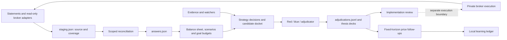

# Worker Placement: current operating contracts

Updated 2026-09-13. This is the current implementation supplement to
[ARCHITECTURE.md](ARCHITECTURE.md), whose September 3 tier design remains useful
but predates the native docket, capability fleet, thesis packs and import refresh.
See [AGENT_HANDOFF.md](AGENT_HANDOFF.md) for verification and next work.

## Product and ownership boundaries

**Worker Placement** is the family office product. **OfficeKit** is its Python
engine. **SignalOS** is the development monorepo and research infrastructure.
The principal's desk is the reference deployment and a migration source.

The durable product is an office folder: reviewed household answers, custody
provenance, constraints, goals, decisions, evidence and local learning. Net worth
comes from the balance sheet. Strategy membership is an overlapping analytical
view; summing strategy values must never become household net worth or a funding
reservation. Adopting a strategy records intent; a court verdict does not create
a position or authorize an order.



The native loop is exercised offline in `tests/test_officekit_operating_cycle.py`.
It uses real registry, docket, court persistence and office rendering with fake
model responses, synthetic custody and recorded synthetic prices. It proves
integration and restart behavior, not profitability, live execution or independent
court quality. A live office-native reference run is still owed.

## Custody coverage and reconciliation

`staging.record_pull(..., snapshot=...)` accepts explicit coverage. A factory may
optionally expose a `snapshot(ctx)` callable returning this envelope through
`officekit_adapters.fetch_snapshot`:

```json
{
  "as_of": "2026-09-13",
  "rows": [
    {"account": "A", "symbol": "AAA", "sec_type": "STK", "ccy": "USD", "value": 1000},
    {"account": "A", "symbol": "USD", "sec_type": "CASH", "ccy": "USD", "value": 500}
  ],
  "snapshot": {
    "mode": "complete",
    "accounts": ["A"],
    "security_types": ["STK", "CASH"],
    "totals": {"A": 1500}
  }
}
```

The example is synthetic. Production control totals must come independently from
the broker or statement for precisely the declared coverage. **Never certify
completeness by summing the returned rows themselves.** Totals and `value` must be
in the office base currency; adapters own conversion and its provenance. The
current validator checks coverage and numerical reconciliation, not FX correctness.
It requires finite numeric market values, no cost-only rows, an as-of date and
per-account agreement within 1.1 cents. Validation runs before replacing a good
source. Same-source snapshots cannot move backward in as-of time.

| Pull | Updating owned positions | Closing absent positions |
|---|---|---|
| Legacy fetch or `mode: partial` | Refresh known marks, retain absent account contributions | Never |
| Valid `mode: complete` | Apply covered marks with source/date metadata | Only owned positions in covered accounts and security types, at least as fresh as their marks |
| Fetch/validation failure | Keep the last successful source | Never infer a closure from the failure |

Existing adapters remain **partial**. The optional envelope is an integration seam,
not evidence that IBKR or another connector already provides verified complete
coverage. Manual and daily adapter routes use the same seam. Failed attempts are
stored with `last_error` and `last_attempt_utc` and shown in the import ledger.

`merged_rows()` orders observations by economic as-of date, then pull time.
Generic or missing account labels retain source-scoped observations. A complete
snapshot may suppress or close such a contribution only when its source matches
the contribution's persisted provenance. Partial omissions retain the other
source's accepted mark. Updates, stale-mark checks and cost-only fallbacks use
the same source boundary; a placeholder label cannot join their ownership.

For non-generic account labels, the existing cross-source matching/supersession
policy is unchanged. **Matching labels do not prove common ownership.** Resolving
independent feeds that share a label is explicitly deferred by the principal
(2026-09-14). A source (API/file) and an owning feed are distinct concepts; a future
explicit ownership mapping must resolve whether sources are competing observations
or independent holdings. This change does not infer that relationship.

Instrument identity includes symbol, security type, currency and contract terms.
Structural option expiry/strike/right/multiplier keep separate contracts separate.
For cash/options/bonds under a generic account label, `custody_key` appends the
source ID to the existing five fields. Old keys recover that suffix from the
persisted `custody_row`, never from an unrelated incoming source. This cannot
recover ownership/value already erased by older imports; those require review of
the retained source data or a new import.

`reconciliation.reconcile()` is a pure transformation of reviewed answers:

- Equities retain per-account contributions in `positions.rows[].accounts`,
  including source, dates, type, market value and available basis/lot data. A sale
  removes only the covered account contribution. ETF coverage stays ETF coverage.
- Cash, options and supported fixed-income marks use separate sleeves with
  `meta.custody_key` and `meta.custody_row`. Complete coverage may add these;
  later partial pulls may update already-owned marks. Short-put marks are not
  collateral commitments; existing obligation calculations remain a separate view.
- Manual non-equity sleeves are retained. A potential overlap requires ownership
  review instead of creating duplicate value. Unowned legacy equity rows retain
  symbol-based migration behavior and need review before trusting account attribution.
- Cost-only refreshes preserve a known market mark. A new cost-only position without
  a market mark remains in staging with a reconciliation warning, not a made-up NAV.
  Incomplete account basis or tax-loss totals are not presented as complete totals.
- `answers.reconciliation` records counts, closures and warnings for the import page.

An empty, complete, independently reconciled snapshot can close a covered account;
an empty partial pull cannot. Unsupported instrument types produce review warnings.
There is no corporate-action engine, currency reconciliation engine, transfer
matching or automated adoption of manual sleeves in this change.

Source writes are atomic within one server process. Rendering still writes several
office files; it is not an atomic transaction across answers, balance sheet and
pages. Multiple processes writing the same office need additional coordination.

## Strategy truth and model estimates

Bucket labels describe intended roles. They do not certify resilience, liquidity,
independence from market shocks or money reserved for a goal. Undated goals have
unknown horizons. The UI labels overlapping thesis values as view exposure.

`thesis_board.stress_estimate()` matches thesis symbols to actual modeled holdings
or concentrated single-name sleeves and reuses the scenario planner's first-order
category beta priors and scenario overrides. Complete symbol coverage is required;
otherwise stress is unknown. The output reports the worst applicable modeled
scenario, estimated dollars and percentage of gross matched exposure, and model
as-of date. Financing, nonlinear effects and exit liquidity need separate review.
These are modeled estimates, not measured outcomes or a position-specific risk
model. A symbol used by multiple strategies can be represented in multiple views.

Strategy packs are untrusted authored data. Validation checks manifest shape,
slug and deck containment, including resolved symlinks. A valid pack has zero
portfolio value and no court verdict/date. It can augment a held thesis's narrative
and deck, but cannot overwrite custody values or adjudicated verdicts. Native court
records supersede imported desk decisions, including when live value becomes zero.
See [contribution rules](../strategies/CONTRIBUTING.md).

Risk exclusions come from the office's `personal_context.json`, not an embedded
principal/employer name. Missing context produces an explicit unchecked status;
an empty configured exclusion list means no such restriction has been declared.

## Evaluation and learning

The court now mechanically preserves the union of red, blue and adjudicator
unverified items. The adjudicator cannot silently drop an unresolved bench item.

Price follow-up protocol `fixed_horizon_v1` uses the first close on/after the verdict
date and the first on/after a fixed target date, each within seven calendar days.
It excludes future quotes and pre-verdict prices. Missing windows fail visibly and
can be retried. The default horizon is 30 calendar days. `STARTER`/`OWN` are treated
as positive direction, `AVOID`/`KILL` as non-positive; other verdicts abstain.
This daily-price convention does not establish tradable intraday execution, total
return, benchmark-relative alpha or a calibrated probability.

Ledger entries retain `grade_kind`, `protocol`, horizon and entry/exit dates. A
protocol/adjudication/horizon key makes normal reruns idempotent; the watcher can
recover the key from the ledger after a lost cursor. Older arbitrary-horizon grades
remain historical records and may coexist with a new protocol grade. Consumers
must group by protocol. Concurrent watcher processes still require coordination.

`python3 -m officekit_ai.evaluation cases.json` compares frozen analyst/court calls
on the same independently resolved events. Each case requires:

- `id`, named `event`, shared `evidence_hash`, boolean `outcome`, `resolved_at` and
  independent `audit_ref`;
- both `analyst` and `court` calls: the same evidence hash, `frozen_at` before
  resolution, event probability `p`, action `accept|reject|abstain`, `cost_usd`,
  `latency_s`, `audited_claims` and `unsupported_claims`.

It reports paired Brier scores and their difference, false accept/reject counts,
abstentions, independently audited unsupported-claim rates, total cost and latency.
Conviction is not converted into probability. Unresolved cases are excluded and
listed; duplicate cases or evidence mismatch are rejected. This evaluates supplied
records; it cannot authenticate an audit reference or prove an evidence hash was
frozen honestly. Synthetic fixtures verify arithmetic. A real, independently
audited corpus and uncertainty estimates are still required to claim superiority.

## Portable package boundary

`officekit_dist/assemble.py` stages six packages, the generic agent corpus, the
strategy template and the municipal-dislocation example. Household strategy packs,
the private desk and monorepo research implementations are excluded. Both packaging
metadata files declare the default IBKR, Robinhood and TOTP dependencies.

The generic tape source survives outside the monorepo. Fleet wrappers with missing
implementation files report `UNAVAILABLE` before running; dynamically discovered
generators are absent when their source directory is absent. A page in the registry
does not prove its external implementation or credentials are installed.

`tests/test_officekit_portable.py` builds a wheel, installs it to a temporary target
and launches an isolated Python process outside the checkout. It renders/reloads a
second household and verifies bundled packs and unavailable capability behavior.
It uses no dependency downloads or broker/model calls. Supported Python versions,
fresh dependency resolution, broker setup and live first-run experience remain
separate release checks. Public publication and hosted/execution tiers are not part
of this implementation.


## Daily brief and strategy workspace (2026-09-13)

Home leads with a daily decision brief derived from `risk_officer.review`, then
goals and their funding constraints. Cash now, saleable investments and expected
net inflows are separate amounts. Expected inflows remain unavailable until
received. The balance-sheet as-of date and source links stay visible. Editors,
factor matrices and alternate views use disclosure controls; tenant-authored
opportunity notes remain available. No blanket “sourced / done” claim is inferred
from the presence of a confidence tag.

`goals.evaluate_in_model` is the shared present-state assessment for Home,
strategy planning, Risk Officer and the Scenario Planner. Financed purchases and
ongoing expenses use the existing `goal_projection` affordability model. A
purchase must cover both gross cash raised for closing and sustainable annual
carry after existing debt service. A scenario evaluates copies of sleeves at
shocked values; it never mutates the base book. A closing surplus cannot turn a
carry deficit green. Ratios show two decimals and a carry shortfall includes its
annual dollar gap. Other goal kinds retain the no-growth check; their separate
growth projections remain labeled estimates. This does not introduce a goal
capital-reservation ledger or improve the underlying financing/tax priors.

Strategies lead with searchable thesis views: Held, Under review, Watching,
Drafts and All. Held comes from positions/value, independently of court opinion.
Under review overlaps Held when a recorded review flag or pending docket calls
for attention. A format-valid authored pack without a verdict or holdings is an
unreviewed draft. The main cards use readable statuses; raw court verdicts and
pack validation provenance remain in details. These filters cover thesis views;
general strategy mandates and their candidate dockets remain in the library.
Goal adoption, court, purchase-recording and strategy-creation controls retain
their existing endpoints. Goal/role groupings are alternate views of the same
holdings, not additional capital or evidence of safety.

The shell mirrors the actual iframe page in its active navigation and encoded
`#view=` URL. It preserves goal/asset/detail links and anchors across reloads;
disclosure ancestors open for linked targets. At narrow widths, an accessible
workspace selector exposes every destination. Build-version polling reloads a
clean page, but input/change events defer the refresh and show an explicit reload
control while edits are unsaved. This guard covers incoming rebuilds, not draft
persistence after the user deliberately navigates away.

`portfolio_mix.validate_mix` is the target allocation boundary: finite percentages
in [0, 100], totaling 100, without leverage or negative residual cash. Both
statistics and the save endpoint reject invalid input. Invalid legacy targets
remain untouched on disk; Growth visibly falls back to the current mix for review.
Sliders offset one another at the limit, and return, volatility, drawdown and chart
preview update before saving. Browser priors are emitted from the Python constants.
Current allocation excludes private assets and pending cash, nets signed balances,
and uses reconciled rounding. Risk Officer describes current holdings; Growth
labels the hypothetical target separately.

Imports lead with existing/detected connections; setup choices are collapsed.
Missing credentials offer setup rather than a failing first pull. Previously
imported sources keep their retry control even when cached discovery says absent.
Timestamps are displayed as local dates and ages never go negative. Signals lead
with recorded checks needing attention or up-to-date results; capabilities with
no recorded run remain explicitly “Not run yet.” Harvest groups overlapping
wash-sale checks in a disclosure with a visible warning, retaining per-position
flags and every detailed check.
# Commitment contract update — 2026-09-14

[COMMITMENTS.md](COMMITMENTS.md) defines the implemented commitment and cash
calendar contract and supersedes earlier descriptions of this layer as entirely
future work. User facts are durable overrides or asset edits; inferred annual
commitments remain first-call budget items when confirmed. AI refinement is a
targeted, revision-checked proposal with an explicit before/after apply step.
Capital reservations in the calendar are explicit earmarks, not strategy values,
custody holdings or execution authorization.
