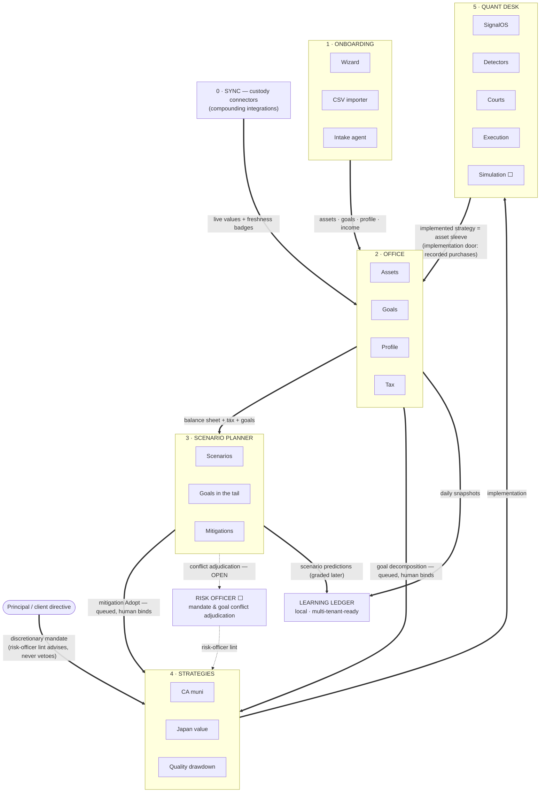
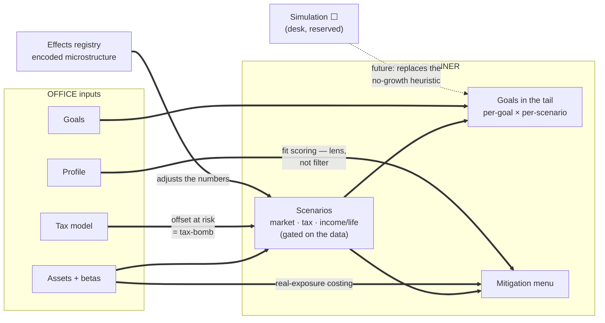
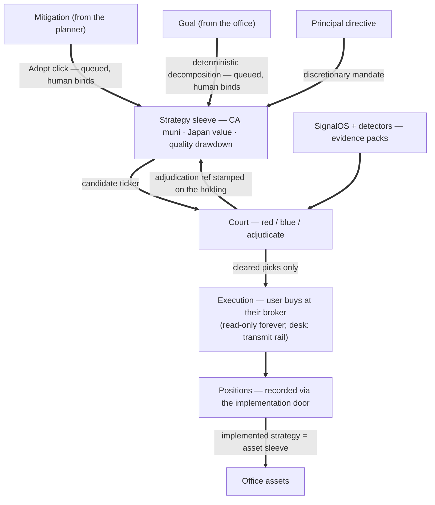

# PRD — The Family Office Platform

**officekit + the quant desk: import your finances, see your whole financial world, stress it against your goals, and run strategies with institutional-grade diligence.**

Status: living document · v1.2 · 2026-09-02 · owner: Ajay (principal) · reference deployment: the signalos desk

**Implementation update, 2026-09-13:** the product is named **Worker Placement**;
OfficeKit is its engine. The native docket, courts, thesis decks, capability
registry and strategy packs now exist. Scoped import reconciliation and a synthetic
end-to-end acceptance cycle are implemented; real adapter completeness and a live
native cycle still require acceptance. Use [OPERATING_CONTRACTS.md](OPERATING_CONTRACTS.md)
for current behavior and [AGENT_HANDOFF.md](AGENT_HANDOFF.md) for the next gates.
This PRD's original diagram/status labels are retained as historical design context.

---

## 1. Vision

Paper family offices exist for people with $100M. Everyone else gets a brokerage dashboard that shows one account, no goals, no tail analysis, and no honesty about what it doesn't know. We are building the thing in between: a **glass-box family office** anyone can onboard into — every sleeve of their balance sheet, its factor risk, what the tail scenarios do to their *goals* (not just their money), a costed mitigation menu scored to who they are, and a path from mitigation to named strategies implemented by a quant desk where **every ticker picked carries a deliberation and an adjudication**.

We are user #1. The reference deployment is the principal's own household ($18.9M, 13 sleeves), and every feature ships dogfooded there before it generalizes. The engine never fabricates: values are statement-sourced or tagged TBD, betas are labeled first-pass estimates, and goal math announces its own conservatism.

## 2. The system (merged diagram)

This merges the principal's notebook sketch (2026-09-02) with the ratified design decisions. Solid arrows exist in code today; dashed arrows are designed but owed.

Read it as the closed loop of the sketch: **1→2→3→4→5→2**. Strategies have **three drivers, not one**: scenario-planner mitigations, goals, and plain principal direction — and as of 2026-09-04 **all three edges are wired** (plus the `agent` source, queued): mitigations adopt by explicit click, goals decompose deterministically into sized queued proposals (`officekit/goal_mandates.py`), the principal mandates directly. Automated sources queue; humans bind. The risk officer remains the OPEN overlay: conflict adjudication among mandates and goals, advising the queue rather than gatekeeping it. And the loop closes on the sketch's key phrase — **"strategy turns to assets"**: once implemented, a strategy stops being a plan and *becomes an asset* — a sleeve in the Office with a value, factor betas, and a target weight, stressed by the Scenario Planner and scored against goals exactly like any inherited holding. That return edge shipped 2026-09-04 as the implementation door (recorded purchases carry adjudication refs and flip the strategy to implemented); live position feeds via sync connectors upgrade it from recorded to streamed. Two layers wrap the loop: the SYNC layer keeps the Office true (every custody feed is a registered connector; stale data badges itself), and the LEARNING LEDGER records what the loop predicted so outcomes can grade it. The RISK OFFICER — the planned intelligence layer — adjudicates conflicts among mandates and among goals themselves ("become a billionaire" vs "preserve capital"); the principal is always the final authority.

### 2a. How a balance sheet becomes a scenario read (inside 2→3)

Every mitigation is always shown; the profile only scores it. The effects registry is how a new market insight changes the numbers without an engine edit.

### 2b. How a strategy mandate becomes positions (3→4→5→2)

Three rulings encoded here. First, **a strategy mandate has three legitimate sources** — a planner mitigation, a goal, or the principal directly — and whichever door it enters through, it flows through the same court gate. Second, **every ticker a strategy picks carries a deliberation and an adjudication** — courts sit between the pick and the order, and the adjudication ref travels back onto the sleeve's holding so the office can show diligence coverage. Third, **an implemented strategy is an asset**: its positions become a sleeve in the Office (never a blended alpha line) with a value, betas, and a target — which means the Scenario Planner stresses it, the goal grid scores it, and its own risk can spawn the next mitigation. That is what closes the loop.

## 3. Users

1. **The principal (us)** — reference account, full desk behind it. Every feature proves out here first.
2. **External accumulator** — imports a CSV, answers the wizard, gets office + scenario pages. Served today by Phase 1.
3. **Decumulating retiree / levered / endowment** — same pages, re-scored: the mitigation fit engine and preset switcher already treat profile as a lens, not a filter.
4. **Advisor / RIA (later)** — white-labels the pages via prose packs; the full-menu/lens framing is the compliance posture.

## 4. Components and status

| Component | What it does | Status |
|---|---|---|
| **Intake wizard** | interview or answers-JSON → validated balance sheet | ✅ Phase 1 |
| **CSV importer** | positions export → classified sleeves; ≥20% single stock splits out as concentrated | ✅ Phase 1 |
| **LLM intake agent** | statements → answers JSON per contract; goals only from the user's mouth | ✅ contract shipped |
| **Beta priors** | category + style loadings; zero-vector for unknowns, never a guess | ✅ Phase 1 |
| **Office dashboard** | sleeves, targets, factor betas, pairwise beta matrix, opportunity inbox, goals panel | ✅ Phase 0 + 2 |
| **Scenario planner** | (renamed from Disaster Planner, ratified 2026-09-02) 8 market scenarios + gated tax-bomb + gated income-shock + life-event `goal_ov` scenarios; sleeve×scenario P&L; liquidity survival; playbook | ✅ Phase 0 + 2 |
| **Goals engine v1** | retirement / spending / floor status, today and per scenario; no-growth heuristic, labeled | ✅ Phase 2 |
| **Tax-as-disaster** | "Unsheltered gain" scenario prices the harvest offset at risk; harvest/DAF/DI mitigations | ✅ Phase 2 |
| **Effects registry** | 5 encoded microstructure programs, dispatched per scenario; fires only when the client's data supports it | ✅ Phase 0 |
| **Strategy sleeves + adjudication** | `sleeve.strategy` + per-holding `adjudication{verdict,date,ref}`; chips render | ✅ schema · 🔶 desk split OWED |
| **Live position feed** | desk positions → per-strategy sleeves in the office | 🔶 owed (needs polling + ledger classification) |
| **Simulation** | backtest, Monte-Carlo paths, pre-trade what-if | ⬜ reserved slot, deliberate |
| **Server** | Tier-0 local app SHIPPED (`officekit.serve`: in-browser onboarding — CSV upload, sleeves, income, goals, profile — → app shell with Office/Scenario tabs); multi-tenant hosted tier planned | ✅ local v0 · ⬜ hosted |
| **Sync layer** | custody-connector interface + registry; per-sleeve provenance/as-of badges; FRESH/STALE/ERROR reporting — integrations compound (IBKR board + Parametric scorecard live; CSV generic) | ✅ interface + first connectors |
| **Learning ledger** | append-only local outcome records (snapshot / scenario predictions / goal statuses); multi-tenant record contract + shareable-export allowlist (no names, no dollars) | ✅ local v1 |
| **Human capital** | income capitalized into a beta-bearing sleeve (styles: equity_linked/stable); enables the income-shock scenario + disability/term-life mitigations | ✅ shipped |
| **Strategies page** | box 4 made navigable: current sleeves + planned strategies as cards (status from recorded `strategy_decisions` — implemented/considering/declined/NOT DECIDED, never inferred; current vs target %, sample subassets, recommended-by scenarios, holdings w/ adjudication counts); mitigations on the Scenario Planner are LINKS that land with the right card open. CREATION (both doors, ratified 2026-09-03): **ad-hoc principal-directed** ("Record the mandate" form — attaches to a library strategy or defines a custom one) and **adopt-from-planner** (an explicit "Adopt →" click on a mitigation sets the strategy `planned`, never downgrading an existing status). Every action appends an ORIGIN — {source: principal\|scenario, ref, date} — so each card shows its **mandate trail** | ✅ shipped |
| **Risk officer** | conflict adjudication across mandates AND goals — deterministic lint core first, then an agentic allocation court (red/blue on the mix); advises the principal, never overrules | ⬜ own workstream |
| **Courts (desk)** | red/blue adversarial adjudication per ticker | ✅ exists privately; `courtkit` extraction planned |

### 4a. Risk officer — the two-tier design

The conflict problem is real at two altitudes, and only one needs intelligence:

- **Tier 1 — the LINT (deterministic, ships in Phase 3).** Mandates (all three sources) and goals cross-checked against each other and against hard structure: liquidity floors, sleeve caps, concentration, the profile flags. "This directive conflicts with your liquidity floor" and "this mitigation and this goal pull the same sleeve opposite directions" are computable. Output: conflict findings, rendered on the office page and recorded to the learning ledger.
- **Tier 2 — the AGENT (Phase 4).** Goal-vs-goal conflicts — "become a billionaire" vs "preserve capital" — are a values negotiation, not a rule check: required-return math, tradeoff framing, a written ruling. The blueprint already exists as the office page's Red/Blue **allocation court** lane; the risk officer is that court productized as a standing officer, convened whenever the lint fires or the mandate mix changes.

Doctrine (non-negotiable): the risk officer **advises and documents; it never vetoes**. The principal overrules knowingly, and the overrule is itself recorded. Its rulings are learning-ledger records, so its calibration is gradeable like everything else.

### 4b. Life-event scenarios — the `goal_ov` mechanism (✅ shipped with the rename)

Life events ("having a kid", career change, relocation) are just scenarios — but they shock the **goal set and spending**, not asset marks. Scenario dicts carry an optional `goal_ov` override: a scenario may add goals (a college target) or modify them (raise retirement annual spending via `*_delta` fields); the goals-through-the-tail grid re-scores each column under that scenario's effective goal set, and a "—" cell means the goal doesn't exist in that world. Life-event scenarios aren't shipped as defaults — they're personal; clients add them via the `scenarios.add` overlay. Shipped 2026-09-02 together with the ratified **Scenario Planner rename** (pages, tab, modules, data key `scenario_text` with the legacy key honored).

### 4c. Reference deployment — first-day proof (2026-09-02)

What the new layers did on their first live run against the principal's account:

- **Sync**: the IBKR connector restated the alpha sleeve $211k → **$931k** (fresh, same-day) — correcting a ~$720k silent understatement of net worth ($18.90M → $19.74M) — while the Parametric connector marked $9.145M and badged it **STALE · 2026-07-07** on the page. The layer's first act was catching exactly the rot it was built for.
- **Learning**: the ledger froze its first `scenario_run` predictions (worst case: tech −26.5%; tax-bomb −3.0%) — the graded-call seam is armed for the next real drawdown.
- **Human capital / income shock**: live and gated — present only for balance sheets that capitalize income, absent from the principal's page, proven on test clients.

## 5. Data contracts

Everything crosses module boundaries as data; the contracts are the product boundary. Full field-level reference with examples for every emitted JSON: [SCHEMAS.md](SCHEMAS.md).

- **BalanceSheet v1** (`officekit.schema`) — sleeves + betas + profile + tax model + goals + personalization overlays. Validated, versioned; the target for every importer.
- **Answers JSON** (`officekit.intake`) — the simplified intake shape (no betas, debts positive). Written by the wizard and the LLM agent alike.
- **Scenario overlays** — `replace/add/drop` patches so client data personalizes the generic scenario library (the principal's account carries its own prose this way; the library stays client-neutral).
- **Adjudication refs** — `{verdict, date, ref}` on holdings; the seam where courtkit plugs in.
- **SyncSnapshot** (`officekit.sync`) — what any custody connector returns: as_of, provenance, sleeve updates. A new institution is a new registered connector + a test, never an engine edit.
- **Learning records** (`officekit.learning`) — versioned, tenant-tagged, born-shareable payloads (category weights, betas, ratios, NW decade — never names or dollars); `export_shareable()`'s per-kind allowlist is the phone-home contract.
- **Harvest feed** — an injected snapshot (never read by the package) so a live tax-loss engine can drive the reserve.

## 6. Principles (non-negotiable)

1. **Never fabricate.** Unknown = TBD, assumptions labeled EST, heuristics announce themselves on the page.
2. **Read-only.** officekit renders; it never places orders and ships no execution integration. Execution lives only in the private desk behind its own rails.
3. **The generator never grades itself.** Strategy picks get independent adjudication; goal math gets replaced by simulation, not tuned to look better.
4. **Full menu, fit as a lens.** Every mitigation is always shown; the profile only scores it. No baked exclusions.
5. **Personal data never enters the package.** All personalization lives in the client's data file; a leak test enforces it.
6. **Degrade loud.** Every synced number carries provenance and an as-of; stale data badges itself on the page; a failed connector is an ERROR row, never an absence.
7. **Golden discipline.** Renders are byte-tested; goldens regenerate only on intentional, audited diffs.

## 7. Roadmap

Technical architecture for the delivery tiers (local OSS → hosted multi-tenant → managed execution): see [ARCHITECTURE.md](ARCHITECTURE.md). Intelligence in onboarding and strategy building (intake agent productized, classification fallback, strategy advisor, courtkit-lite): **proposed** in [INTELLIGENCE.md](INTELLIGENCE.md), pending ratification.

| Phase | Scope | State |
|---|---|---|
| 0 | Engine extraction from the desk, byte-parity proven, hourly render fixed | ✅ done |
| 1 | Intake: wizard + CSV importer + agent contract + beta priors; first external user | ✅ done |
| 2 | Goals + goal-aware disaster read; tax-bomb scenario; strategy/adjudication seams | ✅ done |
| 3 | **Desk strategy-sleeve split** (live positions → per-strategy sleeves; the IBKR connector already syncs the blended value) + the **risk-officer LINT** (deterministic mandate/goal conflict detection) | next |
| 4 | Simulation v1 (pre-trade what-if first, then paths for goals) + the **Risk Officer agent** (the allocation court productized) + **push alerting** (goal-status and freshness flips → notification, via the desk's watch/mailer machinery) | planned |
| 5 | Open-source split: `officekit` repo (fresh history, neutralized strings, Sam-grade goldens), entry-point plugins (effects / importers / scenarios / betas / **connectors**), server package; **schema v2** (account/custodian/lot structure for real trim costing + cross-account wash-sale surfaces) | planned |
| 6 | `courtkit` (adjudication protocol as spec + reference impl) and `deskkit` (watch/registry/signals harness, ships empty) | planned |

Open-source posture (discussed, not yet ratified): engines public, knowledge private. If we go glass-box radical — publishing diligence and strategies too — publication is **state-gated** (post-fill or post-kill, never pre-position), frozen calls publish at freeze, and the adversarial honesty detectors get a rolling embargo. Tier-3 never publishes: personal identity, live orders, licensed raw data.

## 8. Success measures

- Time from "here are my statements" to a rendered scenario page (target: one wizard session).
- Schema validation pass rate on agent-produced answers (fail-loud beats silently wrong).
- Zero personal-string leaks into generic renders (enforced by test, forever).
- Goal statuses that survive the simulation upgrade (the heuristic should be a floor — if simulation says a goal was *worse* than the heuristic claimed, that's a defect).
- For us: both tabs fresh hourly, and every strategy sleeve carrying live adjudication coverage.

## 9. Open questions

**Q6 update, 2026-09-18:** the historical resolution below is superseded for public
exchange by [RESEARCH_CORPUS.md](RESEARCH_CORPUS.md). Shared cases preserve an
anonymized goal/strategy/investor context and reviewed reasoning. Raw office IDs
and free-text rationale are not public export fields. The central two-way backend
exchange is still planned; the implemented pilot uses explicitly reviewed files.

1. **The risk officer's write-power** — **RESOLVED 2026-09-04**: automated mandate sources **queue for adoption, never bind**. Ratified via the first automated source: `agent` is an origin alongside `principal | scenario`, and `mandates.queue_agent_proposal` enforces queue-only semantics in code — an agent path can only file `considering`, never touches an existing status, and every proposal's origin `ref` points at a frozen `agent_call` ledger record. **The `goal` source shipped the same day** (`officekit/goal_mandates.py`): every goal decomposes deterministically — funding requirement → gap posture (the goal engine's own OK/TIGHT/SHORT) → horizon template (floor/<2y → cash mgmt; 2-7y → duration-matched bonds, muni when plane-2 declares a tax state; 7y+ and retirement → core equity) → sized proposal (claim/NW, arithmetic in the note) → queued with origin `{source: "goal", ref: <goal_id>}`, idempotent under rebuilds. All four origin sources now exist; automated ones queue, humans bind.
2. **Goal kinds** — v1 ships retirement / spending / liquidity_floor; ambition goals ("reach $X by year Y") are wanted for the conflict engine and from user feedback.
3. **Branding** — publish under SignalOS or a neutral name? Gates the Phase-5 repo split.
4. **Non-US tax** — honestly US-only; a `tax_adapter` seam exists on paper.
5. **Effect nuance debt** — the fixed-rate-debt effect assumes below-market debt; needs a prevailing-rate comparison before it fires.
6. **Whose adjudications back an external user's strategy sleeves?** — **RESOLVED 2026-09-04**: users generate their OWN (an adjudication only means something in the context of the strategy that convened the court — courtkit-lite shipped: `officekit_ai/court.py`, red/blue benches + adjudicator through the BYOM slots, plane-2 gated, U2 tier order enforced at runtime, verdicts honestly labeled LITE with an unverified work queue). Connected tenants exchange two-way: send theirs to the backend, read ours down — building cross-tenant adjudication intelligence over all equities. Every shared adjudication carries WHICH STRATEGY built it, WHICH office, and WHEN (contract #11's exchange allowlist: never sizes or dollars; a deliberately separate channel from the learning ledger, whose allowlist bans tickers).
7. **When does account/lot structure earn its schema?** Flat sleeves suffice for the model; real mitigation costing (which lots to trim, wash-sale surfaces across custodians, tax location) needs custodian/account/lot fields. Slated with schema v2 in Phase 5 unless the strategy-sleeve split forces it earlier.
