# Strategy proposals

## Capital Planner and incoming-income tests — 2026-09-21

Incoming-money proposals use the `capital-planner` agent profile for the existing
research call. Other strategy briefs retain `market-researcher`. Both use the
provider-neutral intelligence interface and the same discovery catalog. No model
stage was added: a one-security plan still has seven calls when no court is reused.

`officekit.capital_planning.inputs` freezes an explicit `capital_plan` from the
proposal's office snapshot. The agent, private suitability court, independent
Risk Officer and pitch builder receive it; the general security court and public
research record do not. The proposal displays the inputs for review.

| Input | Existing source | Use |
| --- | --- | --- |
| Incoming money | Identified inflow, receipts and linked tax model | Separate available deposits from contingent proceeds; reconcile withholding once. |
| Goals | Explicit goals and current goal assessments | Explain tradeoffs and protect stated cash floors. A dated goal is not itself a cash reservation. |
| Strategies | Strategy decisions and sleeve allocation targets | Compare proposed investments with existing intent and exposures. |
| Disaster planning | Scenario Planner, including office overrides and changed goals | Existing-book stress estimates, response options and tripwires. These are assumptions, not a stress test of the proposed basket. |
| Ticker research | Shared derived catalog | Retain original IDs, dates, negative verdicts and links; independently review selected securities. |

Code protects linked tax, portfolio-funded commitments and the sum of stated
liquidity floors before calculating deployment ceilings. Unfunded reserves are
apportioned once across identified pending sources in cents. Ordinary income with
no stated tax rate has a zero allocation ceiling and a visible missing-input
condition. Capital-loss offsets do not reduce ordinary-income tax in this model.
Tax reserves retain cents rather than rounding incoming salary to whole dollars.

For recurring income, the existing `answers.incoming` record can carry
`cadence: monthly|quarterly|annual` and
`planning_period: {start: YYYY-MM-DD, end: YYYY-MM-DD}`. `amount` is the **total
gross inflow for that forward period**, never an amount multiplied by cadence.
The period must fit the current twelve-month cash calendar and start on or after
the office's as-of date. Income-funded bills within that period reduce received
proceeds first, then pending proceeds. Portfolio-funded bills are already in the
calendar and are not deducted twice. Missing or out-of-window periods block
allocation; bills exceeding proceeds leave a visible shortfall. Default `once`
means a single payment, without an inferred recurring expense period. Lifetime
earnings PV never becomes a deployment source. These fields are a model/agent
contract; there is no new recurring-income editor or automatic payroll forecast.

Old completed research without the versioned planning inputs remains historical.
The deployment page offers a fresh revision; adoption and retry cannot relabel
old reasoning as a Capital Planner review. An interrupted job that has not yet
started research recomputes its funding before the first call.

`tests/test_capital_planning.py` covers windfalls, one-off income and bounded
income surplus, partial/full receipts, withholding, cash floors, commitments,
missing inputs, disaster overrides, private/public separation, court vetoes,
frozen retries and legacy proposals. `tests/test_deployment_plan.py` runs both
windfall and income through the rendered hosted form and durable job queue,
including ticker output, idempotence and tenant isolation. Model replies and tax
rates are synthetic; this validates integration and arithmetic, not live model
quality or investment suitability.

## Incoming-capital plan on Home — 2026-09-21

Home and Capital link each identified incoming-money source to its dedicated
`/pages/deployment_<key>.html` page. The lead deployment card navigates there
instead of scrolling to an inline illustration. Each page shows the source's
latest proposal, reviewed tickers, current/conditional allocations, conditions
and cash retained. The page starts `/strategy/deploy` with the inflow's stable
ID; proposals retain `deployment_source` and an inflow-specific source reference.
Two windfalls cannot share a proposal by accident, and an ambiguous source is
rejected. Changed answers hide outdated amounts and offer a fresh proposal;
repeated clicks reuse the current one. Page reads never dispatch paid work.

The `new_capital` brief compares the existing research across sleeves. Its default
funding ceiling is that source's pending proceeds after linked tax and its share
of the cash-calendar shortfall. The shortfall is distributed once across sources
in cents. Recorded net receipts may fund current allocations only up to the
source's net cash after linked tax and the office's unreserved cash. Partial or
full receipt retains the same deployment link and requires a fresh review before
using changed funding. Account cash is never credited twice. An explicitly
requested percentage can further cap the combined budget. The Risk Officer may
reduce it; code computes remaining cash. Capitalized lifetime earnings are never
treated as incoming cash. The old 5% default applies to other strategy briefs.

Every normal strategy proposal, including custom creation and deployment, freezes a
bounded inventory from the same catalog: existing general courts, private
suitability rulings, reviewed contextual cases, imported thesis snapshots and
strategy-pack manifests. Hosted workers also receive published strategy manifests from the shared
research archive through request-scoped access. Original IDs, dates, authors,
negative verdicts and gaps remain visible in the proposal. The inventory is limited
to 32 entries / 30,000 characters and reports omissions. It does not index every
raw report in the legacy archive, and summaries do not become current evidence.
Selected tickers still enter the normal source, general-court and suitability flow.
The existing three-candidate review budget remains in force. Selected tickers retain
links to matching catalog records in `research_attachments`. Browsing the catalog
and deployment research does not require a model call. Cross-area archive search
links tickers to published source files, without treating filenames as findings.
See [the research taxonomy](RESEARCH_TAXONOMY.md) for ingestion and review stages.

`tests/test_deployment_plan.py` follows the actual rendered Home forms through the
local HTTP server and hosted durable job, using synthetic model responses. It
checks saved-research input, tax/commitment funding, ticker output on Home,
idempotency, changed-balance revisions and tenant isolation. No real investment
plan or live provider-quality claim follows from those tests.

Implemented 2026-09-14. Strategy creation opens a substantive proposal, not a status change on a generic strategy card. This supplements the mandate, court and capital contracts.

## Shared creation workflow

The Scenario Planner's **Build proposal**, goal strategy menus, **Create strategy**, and the library's **Build proposal & pitch deck** use `strategy_routes.handle` and `strategy_proposals.create`. All 31 planner responses have distinct starting briefs, including deliberate risk acceptance. Responses sharing a strategy ID still get separate proposals keyed by their source scenario and mitigation. The principal's original request and target are retained.

Existing programmatic agent drafts remain queue-only. Their review button enters the same pipeline and preserves the frozen agent-call origin. Existing holdings and implemented mandates stay implemented while a new proposal is researched; a new mandate starts considering. Normal page renders and rebuilds do not dispatch paid work.

```mermaid
flowchart LR
  Entry[Planner / goal / principal / queued agent draft] --> Proposal[Durable proposal and office snapshot]
  Proposal --> Research[SignalOS research generator]
  Research --> Evidence[Primary sources through SignalOS evidence capabilities]
  Evidence --> Court[Native RED / BLUE / adjudication per candidate]
  Court --> Risk[Risk Officer agent and deterministic portfolio checks]
  Risk --> Pitch[Pitch deck and bounded investment basket]
  Pitch --> Decision[Principal adopts, declines or revises]
```

`officekit_ai.strategy_proposal` registers `strategy_proposal_research` into the existing SignalOS capability registry. It uses the shipped market-researcher directive and configured intake slot. Candidate evidence is fetched through native `evidence_*` capabilities, each recorded in `signals_runs.jsonl`. This is a bounded use of the native registry; it does not blindly run every desk scanner or legacy fleet entry point.

Up to three candidate implementations receive native `run_court` RED, BLUE and adjudication calls. The configured bench/adjudicate tier rule is unchanged. Both benches see the same evidence, portfolio context, source brief and proposed structure. Adjudications carry `proposal_id`; individual model calls carry learning-ledger references. A dedicated shipped Risk Officer directive uses the adjudicate slot and consumes the court records, deterministic `risk_officer.review`, household context and funding constraints. The pitch-builder directive then produces the final investment case, alternatives, downside, implementation and monitoring sections. Six calls for one candidate, up to twelve for three, before provider retries.

## Investments, options and programs

Starting ticker lists are research seeds, never court approvals. The analyst can compare alternatives. ETF evidence combines primary issuer pages, the office's own book and dated market data. Registered funds do not require an SEC contact just to read their issuer pages. Stocks use filing inventory, XBRL, filing text, book and tape. SEC sources still require the operator's contact. Unregistered funds and source failures remain explicit evidence gaps; no fabricated fees, yields or quotes fill those gaps.

Options court the structure on a named underlying, not ownership of that underlying. Their dollars are premium ceilings. Current option chains, contract selection, permissions and covered-share confirmation remain conditions; the current connectors do not supply executable option quotes. Program strategies such as insurance, credit facilities, venture pacing and gifting produce concrete provider/adviser briefs and requested terms, not pretend stock tickers. They also receive native adversarial review.

Adjudications with `subject_kind: options|program` remain in the office's ledger and proposal deck. They are excluded from stock purchase approval attachment, thesis-position projection, security docket deduplication, security price-follow-up grading and the security adjudication exchange. An insurance review or a put approval must not turn into a fake holding or an equity BUY.

## Funding and decision authority

Charitable goals are private strategy inputs. The existing gifting program and
Capital Planner compare cash or owned appreciated securities, direct giving or
a DAF, and reviewed tax scenarios. Explicit cash reservations participate in
the normal funding calculation. Modeled deductions never release tax reserves
automatically. See [CHARITABLE_GOALS.md](CHARITABLE_GOALS.md) for the input and
review contract.

Code owns dollar arithmetic. The requested percentage of net worth defines a research ceiling; without one, the starting assumption is 5%, shown on the page. The Risk Officer chooses 0–100% of that ceiling and candidate weights totaling at most 100%. Current allocations are capped at `cash_calendar.available`, after commitments and current reserves. A separate contingent allocation can use remaining pending proceeds net of linked tax, capped at the remaining research ceiling. It requires receipt reconciliation and a fresh capital check before implementation.

KILL, AVOID and WATCH candidates, explicit ticker exclusions, and an opposing Risk Officer cannot receive positive proposed allocations. Issuer/sector restrictions without machine-verifiable holdings coverage remain visible conditions. Pending proceeds, missing option quotes, unverified court claims and data-source failures prevent an unqualified ready status. Model prose is advisory; the computed allocation table is authoritative. Provider output is validated even if a BYOM endpoint ignores JSON schemas.

Adoption records planned intent only and retains `adopted_proposal_id`. Declining an alternative leaves an already planned or implemented mandate intact. It creates no cash reservation, holding, trade, provider engagement or transfer. Multiple proposals do not reserve independent pools of cash. Before adoption, the answers, normalized portfolio/tax evidence and personal context must still match the reviewed snapshot. A changed office requires a fresh revision. The principal can adopt a conditional plan after reading its conditions; no agent binds it. The decision in answers is the replay/recovery authority.

## Persistence, recovery and UI

`strategy_proposals/<uuid>.json` is the durable job and evidence record. Fields include source/ref, brief, target, frozen answers/model/personal context, request digest, status, stage history, research, candidate evidence, court records, deterministic risk, agent risk, pitch, basket, and model-call references. The proposal is local tenant data, never a shareable learning payload. `strategy_decisions[sid].proposal_ids` links proposals to the mandate. A revision creates a new ID, links `revision_of`, and retains the old evidence with `superseded_by`.

States: queued → running → ready / needs_review, or error; principal decisions produce adopted / declined; a revision marks its predecessor superseded. One worker per process serializes jobs with at most 16 waiting. Repeated submits coalesce. Successful stages are checkpointed, and retries reuse them; a completed court is also recoverable by proposal ID if the process died before its page checkpoint. Restarts mark interrupted jobs explicitly; GET never re-bills work. A failed partial court may repeat its unfinished bench calls. JSON and HTML files are each atomically replaced, not one filesystem-wide transaction.

Each proposal has `pages/proposal_<uuid>.html`, a seven-section printable HTML pitch deck with actual allocations, court briefs, sources, gaps, progress and review actions. It is HTML with print-to-PDF styling, not a PowerPoint export. Busy proposal pages refresh automatically. The Strategies list reads current stage/status from a read-only endpoint so background progress is visible without rebuilding financial facts.

## Validation and remaining integration limits

`tests/test_officekit_strategy_proposals.py` exercises native court and SignalOS orchestration with deterministic provider responses, all planner playbooks, funding and exclusions, programs/options, recovery, revisions, source failures, output validation and all HTTP creation doors. Existing office tests run alongside these. Browser acceptance covers planner → proposal, provider failure, and a clearly labeled synthetic completed pitch with a current/contingent allocation split.

Provider authentication, quota or credit failures pause the job with an actionable retry message; they never become successful research. Future connector work: current option chains and broker permissions, authoritative fund look-through for issuer/sector restrictions, and actual lender/broker/insurance/private-fund terms. Source gaps stay on the proposal until verified; approval language must never hide them.

## Mutation and failure contracts — 2026-09-15

All strategy POST forms carry the office revision used for their page. The server
checks it inside the office write lock before creation, retry, revision, adoption,
decline or removal of a goal origin. Missing/stale revisions require a reload;
replaying the same recorded decision is idempotent. Proposal pages refresh the
form revision on GET but retain their frozen research snapshot. A fresh form
does not bypass the separate current-evidence gate on adoption.

Use `mandates.validate_target_pct` for allocation inputs in manual mandates,
agent drafts and proposals. It permits absence or a finite value above zero and
at most 100, and rejects booleans before mutations or agent-call recording. It
does not rewrite legacy human decisions or cap a goal's calculated funding need.

A full worker queue saves a recoverable proposal error and linked banner without
starting work. Unexpected failures log tracebacks server-side and show a generic
500; validation errors are 400 and recognized provider failures are 502. Do not
convert caught exceptions to strings before handing them to `api_errors`.
